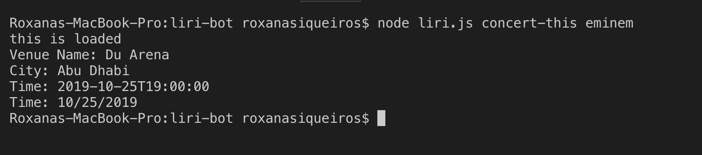
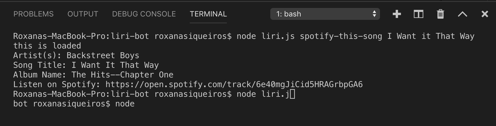
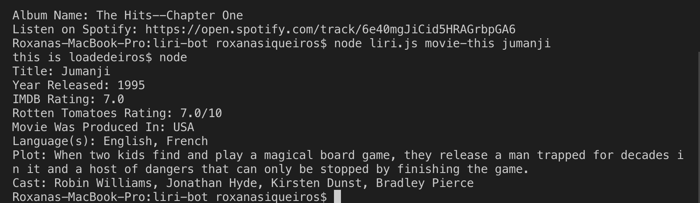

ABOUT THE APP LIRI is a Language Interpretation and Recognition Interface. LIRI is a command line node app that takes in parameters and gives back data. The user has the option of using four commands (listed below) in conjuntion with specific parameters associated with the commands. The Commands are:

concert-this

spotify-this-song

movie-this

do-what-it-says

HOW TO USE LIRI

Step by Step instructions

1.Open your terminal such as Bash.

2.Navigate to the folder that contains the liri.js file.

3.Depending on the command you run, the output will vary.

Example 1: Run the concert-this command

node liri.js concert-this

Output: The system will display a list of all events and locations where the artist or band will perform. It can result in multiple records. The system will also log all the results in the log.txt file. See screen-shot below:

Example 2: Run the spotify-this-song command

node liri.js spotify-this-song

Output: The system will display a list of information associated with the song. It can result in multiple records. The system will also log all the results in the log.txt file. See screen-shot below:

Example 3: Run the movie-this command

node liri.js movie-this

Output: The system will display information associated with the movie. The system will also log all the results in the log.txt file. See screen-shot below:

TECHNOLOGIES USED

-Javascript

-Nodejs

Node packages:

-Node-Spotify-API

-Request

-Moment

-Axios

-Fs

-DotEnv

APIs used:

-Spotify API